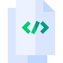
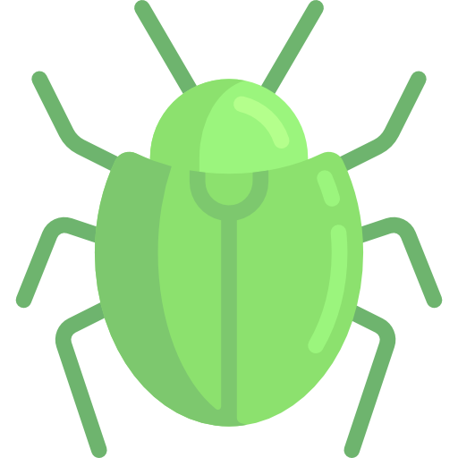

# Game Engine

# Documentation &ensp; 
This is my implementation of a game engine using vanilla JavaScript  
Click [HERE](https://main--sensational-pony-762058.netlify.app/) to take a look.

## [View Function/Method Documentaion](src/ducumentation/functions.md)

## Implementation of Requirements &ensp; 
| Requirement                                                             | Status                                                           |
|-------------------------------------------------------------------------|------------------------------------------------------------------|
| Use the ADT developed in class, or create your own                      |           |
| You should have some sort of tool for managing the background and timing|           |
| You should also support some kind of sprites                            |           |
| Consideration for motion                                                |           |
| Collision Detection                                                     |           |
| Boundary Detection                                                      |           |

## Logic  &ensp; 
* User clicks the `Start Timer`, the only button on screen.
* This will trigger a state change and cause a loop to begin.
* In the loop:
    * Check if the user has clicked `Stop Timer`
        * If so break loop. 
    * We increment the elapsed seconds.
    * Update the UI.
## Small Nuances & Reflections &ensp; 
* If the user refreshes the page, the loaded image is lost from the DOM.
    * This was due to the `.hidden` css property previously applied.
* To handle this I:
    * Alter the html content to remove `.hidden` css style when the page  
      is refreshed.
    * Re-draw the canvas image after the page has reloaded.
* I was under the impression that HTML, CSS, and JavaScript where the only  
  way to add graphics to a UI on the web. Seeing the canvas DOM element definately  
  makes me rethink web graphics.
* I also dindn't realize how interconnected math and computer graphics were. This  
  assignment required me to refresh some of my algebra, and knowledge of the cartesian  
  plane.
* Desmos was really helpful in helping me visualize points on a cartesian plane, with a small  
  caviot of inversing the y valuse of each point.

        
## Credits  &ensp; 
* Icons: 
    * <a href="https://www.flaticon.com/free-icons/document" title="document icons">Document icons created by Freepik Flaticon</a>
* Clock Image:
    * <a href="https://stock.adobe.com/Library/urn:aaid:sc:US:d7f9259d-5e63-427c-823d-a217f93a4126?asset_id=281630869">Licensed from Adobe Stock</a>

# Thanks For Stopping By 😎