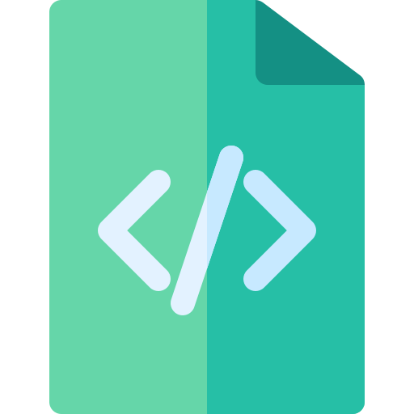

# Game Engine

# Documentation &ensp; 
This is my implementation of a game engine using vanilla JavaScript  
Click [HERE](https://main--sensational-pony-762058.netlify.app/) to take a look.

# Class Documentation
* Documentation to all method and functions:
* [Main.js](ducumentation/Main.md)
* [Scene.js](ducumentation/Scene.md)
* [Sprite.js](ducumentation/Sprite.md)
* [Mouse.js](ducumentation/Mouse.md)
* [Keyboard.js](ducumentation/Keyboard.md)

## Implementation of Requirements &ensp; 
| Requirement                                                             | Status                                                           |
|-------------------------------------------------------------------------|------------------------------------------------------------------|
| Use the ADT developed in class, or create your own                      |           |
| You should have some sort of tool for managing the background and timing|           |
| You should also support some kind of sprites                            |           |
| Consideration for motion                                                |           |
| Collision Detection                                                     |           |
| Boundary Detection                                                      |           |

## Logic  &ensp; 
* User can control the car with:
    * `W`: Go forward.
    * `S`: Stop or go backward.
    * `D`: Turn right.
    * `A`: Turn Left.

* I've decided to implement select methods that will allow me to demonstrate the core functionality of a game engine.
* For Timing and managing the background I've decided to use the setInterval web function.
    * In contrast to the videos, I've decided to implement the `main game loop` as a callback function that I will pass to my start method.
    * The start method sets the interval and schedules `main()` to go off ever 50 milliseconds.
    * Everything inside `main()` will dictate how components are rerendered on screen.

        
## Credits  &ensp; 
* Icons: 
    * <a href="https://www.flaticon.com/free-icons/document" title="document icons">Document icons created by Freepik Flaticon</a>
* Clock Image:
    * <a href="https://stock.adobe.com/Library/urn:aaid:sc:US:d7f9259d-5e63-427c-823d-a217f93a4126?asset_id=281630869">Licensed from Adobe Stock</a>

# Thanks For Stopping By 😎